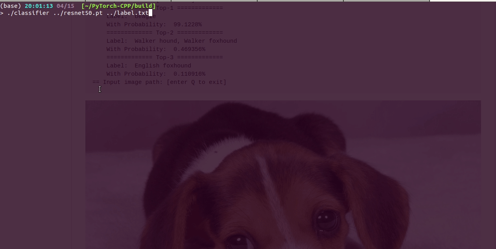
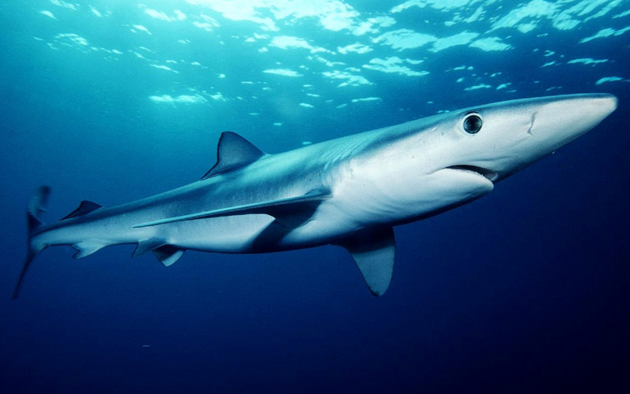

 

This demo will demonstrate how to use LibTorch to build your C++ application.

**[UPDATE 2019/01/18]** : Init the repo, test with PyTorch1.0.  
**[UPDATE 2020/02/22]** : Thanks for [Ageliss](https://github.com/Ageliss) and his [PR](https://github.com/BIGBALLON/PyTorch-CPP/pull/4), which update this demo to fit LibTorch1.4.0 and OpenCV4.0.  
**[UPDATE 2020/04/15]** : Retest this tutorial with **OpenCV4.3**/**PyTorch1.4**/**LibTorch1.4**, update readme for beginner.  
**[UPDATE 2020/04/25]** : Update ``CMakeLists.txt`` to fit **C++14,** retest with **CUDA10.0**/**PyTorch1.5**/**LibTorch1.5**.  
**[UPDATE 2020/11/08]** : Improve readme, retest with **PyTorch1.7**/ **CUDA10.2+cuDNNv7.6.5** and **CUDA11.0+cuDNNv8.0.4**

## Contents

- [Contents](#contents)
- [Preparation](#preparation)
  - [Step 0: Dependencies](#step-0-dependencies)
  - [Step 1: JIT Model](#step-1-jit-model)
  - [Step 2: Cpp Program](#step-2-cpp-program)
  - [Step 3: CMakeLists](#step-3-cmakelists)
- [Build](#build)
- [Usage](#usage)


## Preparation


### Step 0: Dependencies

**Make sure** LibTorch and OpenCV have been installed correctly.

- **Install OpenCV**: for [Linux](https://docs.opencv.org/master/d7/d9f/tutorial_linux_install.html), for [Mac OS](https://docs.opencv.org/master/d0/db2/tutorial_macos_install.html)
- **Get LibTorch**: download LibTorch package from the official [website](https://pytorch.org/get-started/locally/), then unpack it, for example:

```bash
cd path_to_your_workspace
wget https://download.pytorch.org/libtorch/cu102/libtorch-cxx11-abi-shared-with-deps-1.7.0.zip
unzip libtorch-cxx11-abi-shared-with-deps-1.7.0.zip
```

### Step 1: JIT Model

Export torch script file, we use ``resnet18``/``resnet50`` in this demo. (see [model_trace.py](./model_trace.py))

### Step 2: Cpp Program

Write C++ application program. (see [prediction.cpp](./prediction.cpp))

**PS**: ``module->to(at::kCUDA)`` and ``input_tensor.to(at::kCUDA)`` will switch your model & tensors to GPU mode, comment out them if you just want to use CPU. 


### Step 3: CMakeLists

Write a [CMakeLists.txt](./CMakeLists.txt). (check [cppdocs](https://pytorch.org/cppdocs/) for more details)

## Build

- run ``model_trace.py``, you will get a converted model ``resnet50.pt``.
- compile your cpp program, you need to use ``-DCMAKE_PREFIX_PATH=/absolute/path/to/libtorch``, for example:

```bash
mkdir build
cd build
# change "/home/bigballon/libtorch" to your libtorch path
cmake -DCMAKE_PREFIX_PATH=/home/bigballon/libtorch ..
make
```


**PS**: If you get the compile error: ``error: undefined reference to `cv::imread(std::string const&, int)'``, check [issues 14684](https://github.com/pytorch/pytorch/issues/14684) and [issues 14620](https://github.com/pytorch/pytorch/issues/14620) for more details.

## Usage


```bash
classifier <path-to-exported-script-module> <path-to-lable-file>
# example:
# ./classifier ../resnet18.pt ../label.txt
```



```
> ./classifier ../resnet18.pt ../label
== Switch to GPU mode
== Model [../resnet18.pt] loaded!
== Label loaded! Let's try it
== Input image path: [enter Q to exit]
../pic/dog.jpg
== image size: [976 x 549] ==
== simply resize: [224 x 224] ==
    ============= Top-1 =============
    Label:  beagle
    With Probability:  97.0629%
    ============= Top-2 =============
    Label:  Walker hound, Walker foxhound
    With Probability:  1.30952%
    ============= Top-3 =============
    Label:  English foxhound
    With Probability:  0.434456%
```


```
../pic/shark.jpg
== image size: [800 x 500] ==
== simply resize: [224 x 224] ==
    ============= Top-1 =============
    Label:  tiger shark, Galeocerdo cuvieri
    With Probability:  67.672%
    ============= Top-2 =============
    Label:  hammerhead, hammerhead shark
    With Probability:  16.4908%
    ============= Top-3 =============
    Label:  great white shark, white shark, man-eater, man-eating shark
    With Probability:  15.7808%
== Input image path: [enter Q to exit]
Q
```


```
> ./classifier ../resnet50.pt ../label
== Switch to GPU mode
== Model [../resnet50.pt] loaded!
== Label loaded! Let's try it
== Input image path: [enter Q to exit]
../pic/dog.jpg
== image size: [976 x 549] ==
== simply resize: [224 x 224] ==
    ============= Top-1 =============
    Label:  beagle
    With Probability:  99.1227%
    ============= Top-2 =============
    Label:  Walker hound, Walker foxhound
    With Probability:  0.469356%
    ============= Top-3 =============
    Label:  English foxhound
    With Probability:  0.110916%
== Input image path: [enter Q to exit]
../pic/shark.jpg
== image size: [800 x 500] ==
== simply resize: [224 x 224] ==
    ============= Top-1 =============
    Label:  tiger shark, Galeocerdo cuvieri
    With Probability:  92.2599%
    ============= Top-2 =============
    Label:  great white shark, white shark, man-eater, man-eating shark
    With Probability:  5.94252%
    ============= Top-3 =============
    Label:  hammerhead, hammerhead shark
    With Probability:  1.77417%
== Input image path: [enter Q to exit]
Q
```

Take it easy!! :love_letter:
